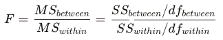
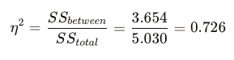

# Briefing

> In day 3, we are performing more extensive experimental testing like ANOVA, linear regression, and more correlation tests between the Hammett constant and additional molecular properties. We are shifting from data analysis to a deeper dive into the patterns we have observed on previous days, and perhaps quantifying them through statistical methods.

## Image 11, Shapiro-Wilk Normality

The Shapiro-Wilk test is a powerful test for small sample sizes, to detect if a sample comes from a normally distributed population. The H is the hypothesis. 0 means data is normal dist., 1 means data is not normal dist. Alpha is the chosen significance level (commonly 0.05) on whether to reject the null hypothesis (in this case, the assuption that data is normal) or not.

W ranges from 0 to 1. A value of 1 indicates perfect normality. Lower values indicate departure from normality. The p-value is the probability of observing your data from a perfectly normal perspective. p > 0.05 indicates data is normal, while p < 0.05 indicates data is not normal (rejection of null hypothesis).

Looking at the Q-Q plot, sigma_meta shows strong deviation at the leftmost tail, which is a key reason why it fails the normality test. This is because there are very few strong EWGs creating a right tail, which leads to the observed rightwards skew.

sigma_para tests do a bit better, being right above the alpha threshold. sigma_resonance is the closest to a normal distribution given our data set. This is understandable since resonance has a greater distribution of effects and strengths across the groups in our dataset.

```R
shapiro.test(hammett$sigma_meta)
```

## Image 12, Paired t-Test (sigma_meta vs sigma_para)

Each substituent has measurements at meta position and para position. These are naturally paired observations from the same molecule. An unpaired t-test would treat all 64 values (32 meta + 32 para) as independent, ignoring the pairing structure. This is why we use a paired test.

Assuming alpha = 0.05, we can make the hypothesis that the mean of paired differences is zero and the mean of paired differences is not zero. To make the calculation we take x = sigma_meta - sigma_para.

We calculate t using the following formula.


Where x is the mean of differences, u is zero (which is the value we are testing for), s is standard deviation, n is number of pairs.

Looking at our output data, we have

| Statistic              | Value            |
|------------------------|------------------|
| Mean σ_meta            | 0.1925           |
| Mean σ_para            | 0.0772           |
| Mean difference        | 0.1153           |
| Mean difference        | 0.1153           |
| Standard deviation     | 0.2015           |
| t-statistic            | 3.2379           |
| Degrees of freedom     | 31               |
| p-value                | 0.002868         |
| 95% Confidence Interval| [0.0427, 0.1879] |

Plug the values 0.1153, 0.2015, and 32 into your calculator using the t-test formula to get t = 3.24, which is what we get from the R program. This means it's very unlikely that the mean is zero.

Furthermore the p-value 0.002868 < 0.05. The difference of 0.115 is __statistically significant__. On average sigma_meta exceeds sigma_para by around 0.115 units. Of course, this is within our expectations. Raw p-values don't tell you how big an effect is. Cohen's d standardizes the difference.


Try calculating this by dividing 0.1153 by 0.2015 to get CD = 0.572. The CI [0.043, 0.188] means we're also 95% confident the true population mean difference lies in this range.

What we just confirmed is the difference is not caused by random chance. Most substituents have similar meta and para values (inductive-dominated), but the strong resonance DONORS (NH₂, OH, OCH₃) pull sigma_para strongly negative while barely affecting sigma_meta. These asymmetric cases shift the mean difference positive. Remember that a negative Hammett constant means they donate electrons.

```R
t.test(hammett$sigma_meta, hammett$sigma_para, paired = TRUE)
```

`paired = TRUE` tells R to compute differences first, then run a one-sample t-test on those differences against μ = 0.

## Image 13, One-Way Heteroatom ANOVA

ANOVA (Analysis of Variance) tests whether the means of 3+ groups are equal. It compares variance between groups to variance within groups.

Following suit, let the hypothesis be that the expected value (mean) of σ_para is independent of heteroatom identity. Looking at the output (run the script to see yourself) we see N and O have striking standard deviations. Does this mean the hypothesis is true?

The ANOVA F-statistic is a test value, calculated as the ratio of between-group variance (MSB) to within-group variance (MSE), used in Analysis of Variance to determine if there are significant differences among group means.



Looking at the ANOVA table, we notice F = 0.67, p = 0.648 > 0.05, meaning we cannot reject the hypothesis. While this may feel contradictory, just look at he nitrogen group. Or the oxygen group. NH₂ and N(CH₃)₂ are strong EDGs, NO₂ and CN are strong EWGs. Of course, while nitrogen is the strongest counterexample, the true chemical insight is that heteroatom identity is a poor predictor of electronic effect. 

After averaging over all bonding modes, resonance patterns, and functional groups, heteroatom identity does not reliably predict σ_para. The same atom can be either strongly donating or strongly withdrawing depending on its bonding.

```R
anova_result <- aov(sigma_para ~ hetero_group, data = hammett)
summary(anova_result)
```

To check for Homogenity of Variance, you can take a look at Bartlett's test (look at p on image 13). p >> 0.0001, which means variances are significantly different across group. ANOVA is not reliable in this case.

## Image 14, One-Way ANOVA (sigma_para by Effect Type)

To prove that ANOVA produces the correct results, same as before, we assume the expected value (mean) of σ_para is let the hypothesis be that the expected value (mean) of sigma_para is __independent__ of heteroatom identity of whether the group is an EDG, EWG, or neutral. You might already know what is about to happen.

If we take a look at the F-value, it's a striking F = 17.93. p ~ 10<sup>-7</sup>. The effect type classification has real impacts on sigma_para, which is not surprising. These results agree with some previous conclusions like the difference in mean sigma_meta - sigma_para being statistically meaningful.

Okay, let's continue. What is the effect size? η² = 0.726, which means 72.6% of variance can be explained using group type classification.



Effect type explains 7× more variance than heteroatom identity. This confirms that electronic behavior (EDG vs EWG) matters more than atomic composition.

### Posthoc Test

We can pinpoint exactly which pairs of group means are significantly different from each other using the Tukey HSD Posthoc Test. We see from the first line that diff of EWG and EDG is around 0.784, with a 95% CI = [0.50919751, 1.05959037]. The adjusted p value is ~ 10<sup>-7</sup> which is strong evidence against the hypothesis.

Strong EWGs have a much larger σ_para than strong EDGs, and the difference is large compared to within-group scatter. Let's keep thinking. Looking down the list, insignificant comparisons include neutral-EDG, weak-EDG, weak EWG-EDG, and weak/neutral categories in general. These groups overlap heavily in σ_para, and their expected value is not enough to spread sample size.

What the Tukey test tells us is rather intuitive. Strong donors and withdrawers are separated, intermediate categories overlap, a result we have seen since day 1, but now quantified.

## Image 15, Linear Regression (para ~ meta)


Can we predict sigma_para from sigma_meta? You know the answer. If resonance didn't exist, yes, and we can predict it "perfectly". Let's take a look at the outputs.

__Coefficients__<br>
If the table doesn't render, look at the code.

| Term        | Estimate   | Standard Error | t value   | Pr(>|t|) |
|-------------|------------|----------------|-----------|----------|
| (Intercept) | -0.185927  | 0.03942068     | -4.71648  | 5.18e-05 |
| sigma_meta  |  1.366828  | 0.12163677     | 11.23697  | 2.83e-12 |

__Model Fit__
| Metric              | Value                         |
|---------------------|-------------------------------|
| R²                  | 0.8080                        |
| Adjusted R²         | 0.8016                        |
| Residual SE         | 0.1794                        |
| F-statistic         | 126.27 (p = 2.83e-12)         |

Around 80.8% of variance is explained, 80.2% adjusted with errors. The model is highly significant, with F = 123.2 and p = 2.8e-12. You can try guessing why, just take a good look at the theory behind the para and meta position's electronic effects in README.md.

### The Coefficients?

__Intercept (β₀ = −0.186)__
- When sigma_meta = 0, which is the hydrogen reference, the model predicts sigma_para = -0.186. 
- The discrepancy is caused by the model attempting to minimize total error.

__Slope (β₁ = 1.367)__
- For every 1 unit increase in meta, para increase by 1.367 units. This means electronic effects are amplified at para compared to meta.
- If you take a look at `day-1-observations.md`, we actually predicted this.

__Coefficient of Determination (R² = 0.808)__
- meta explains 80.8% of variation in para. You can guess where the other 19.2% goes. The primary reason is a word that rhymes with precedence.
- There's a whole list of secondary reasons at the end of `day-2-observations.md`.

### Residual Analysis

Residuals (actual − predicted) reveal where the model fails. For sake of simplicity, I will not show the full tables, but you are welcome to run the script to see for yourself.

1. Negative residuals (σ_para lower than predicted). The model (based only on σ_meta) can't capture resonance donation, so it overpredicts σ_para.
2. Positive residuals (σ_para higher than predicted). NO is a resonance acceptor (withdraws via resonance), making σ_para higher than induction alone predicts.

__Residuals and the Fitted Values Plot__

The LOESS smoother (green curve) checks for non-linearity. A flat line at y = 0 indicates the linear model is appropriate. Our plot shows some curvature—the model slightly underpredicts at both extremes and overpredicts in the middle. This suggests a mild non-linear relationship that a simple linear model doesn't capture.

```R
lm_model <- lm(sigma_para ~ sigma_meta, data = hammett)
summary(lm_model)
residuals(lm_model)
```

## Test 7, Pearson vs Spearman Correlations

Let's compare.

| Pearson correlation (r)                         | Spearman correlation (ρ)                     |
|-------------------------------------------------|----------------------------------------------|
| Measures linear relationship                    | Robust to outliers                           |
| Assumes both variables are normally distributed | Measures monotonic relationship (rank-based) |
| Sensitive to outliers                           | No distributional assumptions                |

Looking at sigma_para and sigma_I, r (0.68) ≈ ρ (0.67). The relationship is linear and there are no influential outliers.

sigma_para and π (hydrophobicity) has r = −0.35, ρ = −0.24. The Pearson correlation is significant (p = 0.047) but Spearman isn't (p = 0.187). A few outliers may inflate the pearson, and the relationship is not strictly linear.

σ_para, molar reflectivity, and E (Taft's steric parameter). Neither correlation is significant. Molar refractivity (size) and steric parameters don't predict electronic effects.

In summary, when should we use each parameter?

| Scenario                            | Use                       |
|-------------------------------------|---------------------------|
| Both variables normal, no outliers  | Pearson                   |
| Non-normal data or outliers present | Spearson                  |
| Pearson ≈ Spearman                  | Relationship is linear    |
| Pearson ≠ Spearman                  | Non-linearity or outliers |

## Test 8, Multiple Regression (para ~ meta + inductive)

Wait, shouldn't we be adding resonance instead? sigma_I is the "pure inductive" parameter. If sigma_meta already captures induction perfectly, adding sigma_I shouldn't do much. This tests whether sigma_meta contains information beyond pure induction.

Let's check R² = 0.949 the adjusted R² = 0.946. The sigma_I increase from 0.808 to 0.946 is no coincidence, since p = 7.2×10<sup>-10</sup>. Even though meta and inducance are highly correlated (r = 0.92), they're not identical. Please take a look at the list at the bottom of `day-2-observations.md`.

| Model             | Residual df |  RSS  | Δdf | ΔSS  |   F   | p-value     |
|-------------------|-------------|-------|-----|------|-------|-------------|
| σ_meta only       | 30          | 0.966 |     |      |       |             |
| σ_meta + σ_I      | 29          | 0.256 | 1   | 0.710| 80.58 | 7.2×10⁻¹⁰   |

This is an example of how correlated predictors can still be useful in multiple regression when they contain complementary information.
