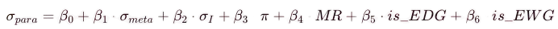

# Briefing

> On day 4, we are doing some basic machine learning by creating models. Note, this isn't actual machine learning, rather us (the human) making layered predictive models to predict the relationship between sigma_para and sigma_meta. We will create five models, and then compare their train COD, test COD, train RMSE, and test RMSE to evaluate which model is the best, then think about why. This is unlike the previous days where we did pure statistical analysis.

## Image 15, Train/Test Split Visualization

The left is a histogram, the right is a scatter plot, colored by assignment, where blue is train and red is test. I will split data into 80% train, 20% test. We need to evaluate models on data it has never seen, and if we just relied on testing, the model could overfit and we would get overly optimistic estimates.

Looking at the data sets, both of them cover the full set of para values, so we are good to move on.

```R
set.seed(42)  # Reproducibility
train_idx <- sample(1:n, size = floor(0.8 * n))
test_idx <- setdiff(1:n, train_idx)
```

## Image 16, Linear Model

Model 1 is a direct extension of the linear regression we saw in model 4.

```
sigma_para ​= param_1 ​+ param_2​ * sigma_meta​
```

| Dataset   | R²        | RMSE      |
|-----------|-----------|-----------|
| Training  | 0.820     | 0.183     |
| Test      | 0.563     | 0.139     |

Looking at the test panel, CHO (aldehyde) is overpredicted and N(CH<sub>3</sub>)<sub>2</sub> (dimethylamino) group is underpredicted.

It actually does pretty well by the eye for weaker groups near the middle. However, this is only the baseline standard. If adding parameters doesn't beat 0.563, we're kind of cooked.

## Image 17, Model 2 Coefficient Plot

Model 2 is a more complex regression model, now with an inductive I factor. You might be wondering why we didn't use sigma_resonance, that's because sigma_para is defined by sigma_resonance, so while we get a "perfect" fit we're using the definition in itself.

```
sigma_para = param_0 + param_1 * sigma_meta + param_2 * I
```

| Parameter  | Estimate | 95% CI           | Interpretation                     |
|------------|----------|------------------|------------------------------------|
| Intercept  | -0.079   | [-0.14, -0.02]   | σ_para when both predictors = 0    |
| σ_meta     | +2.808   | [+2.43, +3.18]   | Strong positive effect             |
| I          | -1.624   | [-2.02, -1.23]   | Strong negative effect             |

__Observations__
- Holding I constant, each unit increase in σ_meta increases σ_para by 2.81 units.
- Holding σ_meta constant, each unit increase in I decreases σ_para by 1.62 units.

Hold on. We know sigma_meta and inductive effects are highly correlated. When we separate them in this model, sigma_meta captures the total electronic effect, and we are decrementing by I to lower the inductive effects to (hopefully) get a better estimate of what the para electronic constant would look like.

You might realize this has zero theoretical basis whatsoever. It's really just crunching the numbers and seeing if they work. This is different from the previous days where all stats were tied down to theory.

In the 95% confidence intervals, neither crosses zero, meaning both coefficients are statistically significant (p < 0.05). We're confident the true population coefficients are non-zero.

```R
model2 <- lm(sigma_para ~ sigma_meta + sigma_I, data = train_data)
coef(model2)
confint(model2, level = 0.95)
```

## Image 18, Model 2 Predictions

Obviously it's still not perfect, although the performance is better for strong EWGs like trimethylammonium on the top right corner (slightly cut off). 

| Dataset   | R²        | RMS       |
|-----------|-----------|-----------|
| Training  | 0.957     | 0.090     |
| Test      | 0.795     | 0.095     |

Adding the inductive factor increased COD from 82% to 96%. The model now explains almost all variance in training data. Test performance also improved substantially to 0.79, breaking the 0.56 baseline. The gap between train and test R² (0.96 vs 0.79) is smaller than Model 1, suggesting less overfitting. RMS also improved from 0.139 to 0.095 on test data.

Just do a visual check and you will notice, the model appears to do better for EDGs as well. Again, by numerical luck, this model performs better.

## Model 3, Polynomial Regression

I will now try to approximate using a quadratic. You can put your bets down right now as to if this will work out well nor not.

```
sigma_para = param_0 + param_1 * sigma_meta + param_2 * sigma_meta<sup>2</sup>
```

In the image, we have the equation of the quadratic. It's a concave up parabola that performs poorly for strong EDGs and EWGs. To those of you that sensed a disaster, you are correct. This is a horrible model.

| Dataset   | R²        | RMS       |
|-----------|-----------|-----------|
| Training  | 0.824     | 0.181     |
| Test      | 0.535     | 0.143     |

We increased R² (COD) by 0.004. Test R² __decreased__ by 0.028. Let's end the discussion right here because the quadratic term does not help at all, and the curvature does nothing but underfit the endpoints.

As a casual reminder the relationship between sigma_para and sigma_meta being quadratic has zero theoretical basis, and as such there's poor correlation. The lesson is that adding polynomial terms is not always better, unless your name is Maclaurin or Taylor and you have access to infinite derivatives.

## Model 4, Interactive Effect

Three regression lines are showing predicted sigma_para vs sigma_meta at different fixed values of I (25th percentile, median, 75th percentile).

In model 4 we build upon model 2, but we make the inductive factor a part of sigma_meta's coefficient.

```
sigma_para = param_0 + param_1 * sigma_meta + param_2 * I + param_3 * sigma_meta * I
```

We test whether the effect of sigma_meta on sigma_para depends on the level of sigma_I. If the lines had different slopes, we can be fairly certain there is an interaction. Rather, we clearly see parallel lines. This means no interaction exists. What that means is this model is identical to model 2, with the interaction term being useless.

| Dataset   | R²        | RMS       |
|-----------|-----------|-----------|
| Training  | 0.957     | 0.090     |
| Test      | 0.795     | 0.095     |

Interaction terms should be guided by theory. There's no chemical reason why inductive and resonance effects would multiply rather than add. The data confirms this.

## Model 5, Variable Weights

We add standard coefficients to all predictors in the full model.



We have to be aware, all the betas in this model is are standardized across our sample's standard deviation. The process works by taking the coefficient from fitting then multiplying it by the data's standard deviation divided by the predictor's standard deviation.

Taking a look at the model importance rankings, sigma_meta dominates with +1.59 standardized beta. sigma_I has the second-largest absolute value with -0.65. Some of the other factors like is_EDG and is_EWG, factors which we quantified as statistically significant on day 4 have small, essentially negligible values. The other factors like PI, MR, and hydrophobicity are effectively useless. We knew that from day 4.

| Dataset   | R²        | RMS       |
|-----------|-----------|-----------|
| Training  | 0.957     | 0.090     |
| Test      | 0.795     | 0.095     |

Training R² increased slightly from 0.957 to 0.962, but test R² decreased from 0.795 to 0.773. This is classic overfitting. The extra parameters better fit the training, not the tests.

## Image 23, Model Comparisons

If you take a look at the comparison in the day4_summary.txt file, we notice M2 is the best model. Simple models like M1 underfit and have low variance. Complex models like M5 have low bias but overfits (high variance). M2 is right in the middle, if we ignore models 3 and 4, which don't align with theory.

## Image 24, Cross-Validation Results

The left panel is R² for M1, M2, M3. The right panel is the mean R² with +/- standard deviation. M2 has highest average R² (0.917) and lowest standard deviation (0.041).

M1 and M3 have high variance. Their performance fluctuates wildly depending on which data is in the test fold (SD = 0.18). Left panel shows the instability. M1 (blue) and M3 (green) have R² ranging from around 0.5 to 0.9 across folds. M2 stays consistently above 0.85.

M2 is more stable because it uses two complementary predictors (sigma_meta and sigma_I) that together capture both inductive and resonance effects. This makes it robust to which specific substituents end up in each fold.

```R
# Manual k-fold CV
folds <- sample(rep(1:k, length.out = n))
for (i in 1:k) {
  train_fold <- data[folds != i, ]
  test_fold <- data[folds == i, ]
  model <- lm(formula, data = train_fold)
  # Calculate metrics...
}
```

## Image 25, Residual Diagnostics

Going clockwise.

__Panel 1, Residuals vs Fitted__
- There's a lot of random scatter around y = 0.
- The LOESS smoother shows some curvature—residuals are slightly positive in the middle and negative at extremes, implying mild non-linearity the model doesn't capture.
- Dimethylamine at the left has the largest negative residual (−0.23). This is the only point exceeding twice the standard deviation.

__Panel 2, Q-Q Plot__
- Points follow the line reasonably well, with slight deviation at both tails.
- Residuals are approximately normal, which we know from day 4.

__Panel 3, Scale-Location Plot__
- Upward trend indicates increasing variance with the fitted value.
- Some curvature exists. Variance is lowest in the middle range and higher at extremes. We call this mild heteroscedasticity.

__Panel 4, Residuals by Substituent__
- Each bar is one substituent's residual, sorted from most negative to most positive.
- We know dimethylamine has residual of -0.23, this is the strongest by far, exceeding the predictions of our model. N(CH₃)₂ is a well-known lewis base and strong nucleophile.
- The nitrogen atom is very electron-dense thanks to its two electron-donating methyl groups. It also has optimal steric hinderance and hydrogen bonding in water, which our model does not measure.
- N⁺(CH₃)₃ has the largest positive residual of +0.16. Another nitrogen-based group, this time the model underpredicts its electron-withdrawing capabilities.
